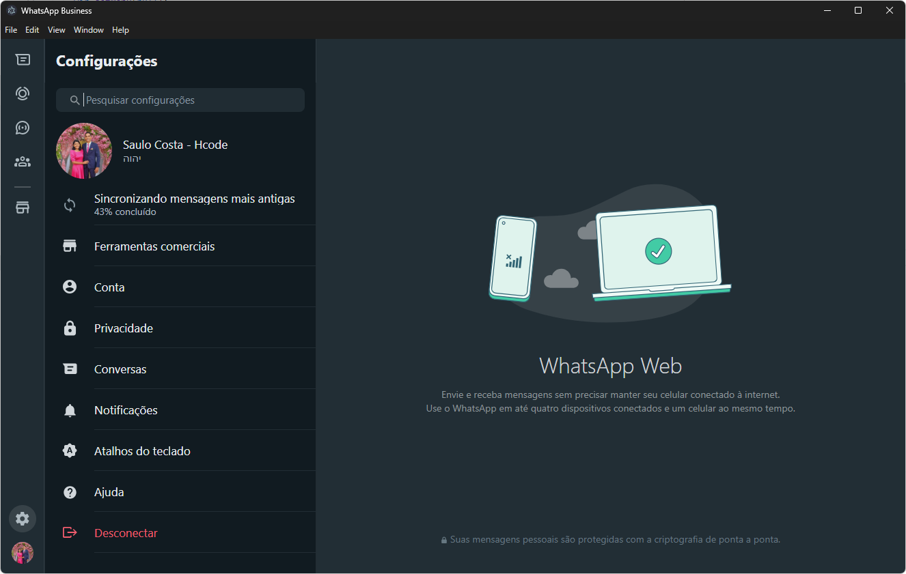

# sc-whatsapp-desktop

> A template to build an ElectronJS app with NextJS

---

<div align="center">
  
  
</div>

<div align="center">
  
  
  
  
  
  
  
</div>

---

<!-- Badge Start -->
<div align="center">
 
 
 
 
 
 
 
</div>
<!-- Badge End -->

---

<div align="center">
  
</div>

---

## Use

```sh
git clone https://github.com/saulotarsobc/electron-next-ts.git;
cd electron-next-ts;
npm install;
npm run dev;
```

## Help

- [Electronjs - documentation](https://www.electronjs.org/pt/docs/latest/)
- [Any Linux Target](https://www.electron.build/linux)

## NPM Commands

- `npm run dev`: Run Electron with development build.
  - `npm run build:backend`: Build backend with TypeScript.
  - `electron . --dev`: Run Electron with development build.
- `npm run prebuild`: Remove build and dist directories.
- `npm run build`: Build frontend and backend.
  - `npm run build:frontend`: Build frontend with Next.js.
  - `npm run build:backend`: Build backend with TypeScript.
- `npm run postinstall`: Install dependencies for Electron.
- `npm run dist`: Build and make a distribution package with Electron Builder.

## electron-builder Configutarion to this project

```yaml
electronVersion: 36.2.1
asar: true
compression: normal
productName: SC - Whatsapp Desktop
appId: br.com.desktop.whatsapp.sc

extraMetadata:
  main: dist/index.js

files:
  - dist
  - frontend/out

directories:
  output: out

publish:
  - provider: github

win:
  target:
    - nsis
  icon: ./build/icon.ico
  artifactName: ${name}-${version}-windows-${arch}.${ext}
  signAndEditExecutable: false

nsis:
  artifactName: ${name}-${version}-windows-${arch}-nsis-installer.${ext}
  allowToChangeInstallationDirectory: true
  oneClick: false
  perMachine: true
  installerIcon: ./build/icon.ico

mac:
  target: dmg
  icon: ./build/icon.ico
  artifactName: ${productName}-Setup-${version}.${ext}
  darkModeSupport: true
  signIgnore: null

linux:
  target:
    - AppImage
    - deb
  icon: ./build/icon.ico
  artifactName: ${productName}-Setup-${version}.${ext}
```

## Git Commands

### Release

```bash
#! bash
git tag "v$1"
git push origin --tags
```
